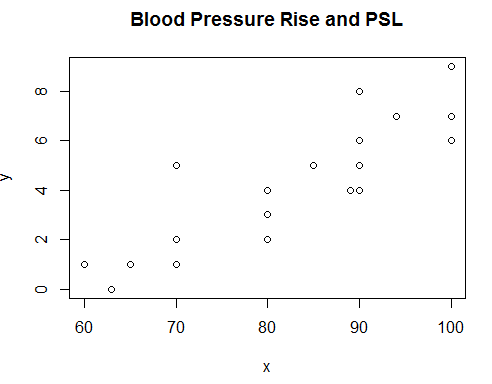
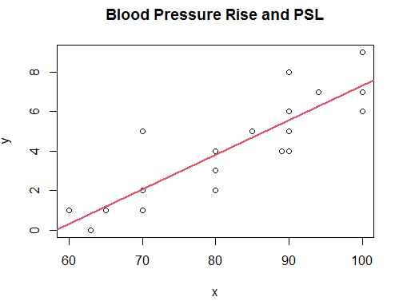
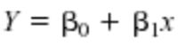

### Question 1
An article in the Journal of Sound and Vibration ["Measurement of Noise-Evoked Blood Pressure by Means of Averaging Method: Relation between Blood Pressure Rise and PSL" (1991, Vol. 151(3), pp. 383-394)] described a study investigating the relationship between noise exposure and hypertension. The following data are representative of those reported in the article.

**A.** Draw a scatter diagram of y (blood pressure rise in millimeters of mercury) versus x (sound pressure level in decibels). Does a simple linear regression model seem reasonable in this situation?

    Yes, because the dependent variable y has a visible linear relationship with the independent variable x in the scattered diagram.




**B.** Fit the simple linear regression model using least squares. Find an estimate of σ^2.

    y = 0.17x - 10.13

    The estimated σ^2 is 28.06316. 





**C.** Find the predicted mean rise in blood pressure level associated with a sound pressure level of 85 decibels.

Using the 


    with β(0) = -10.13 and β(1) = 0.17429
    
    The predicted mean rise in y, blood pressure level, with x, sound pressure level, 85 is 4.68311 ≈ 5.


### Question 2
```{r setup, include = FALSE}

library(ggplot2)
library(tidyverse)
library(data.table)
library(car)


knitr::opts_chunk$set(
  error = TRUE,
  fig.align = 'center' ,
  out.width = "90%" ,
  warning = FALSE,
  message = FALSE,
  
  size = "small" ,
  tidy = FALSE
)
```

An article in Optical Engineering["Operating Curve Extraction of a Correlator's Filter" (2004, Vol.43, pp. 2775-2779)] reported on the use of an optical correlator to perform experiment by varying brightness and contrast. The resulting modulation is characterized by the useful range of gray levels.
```{r, echo=FALSE}
Data <- read.csv("item2data.csv")
print(Data)
Model <- lm(Data$Useful.Range ~ Data$Contrast + Data$Brightness)
summary(Model)
anova(Model)
```


```{r, echo=FALSE}
plot(Data)
```

**A.** Find the multiple linear regression model to these data

    y = 238.5569 - 2.7167X1 + 0.3339X2
    
**B.** Estimate variance

    SSe = SSt - SSr
    
```{r}
SSt <- sum((Data$Useful.Range - mean(Data$Useful.Range))^2)
SSe <- 32446 - 7927.6
MSe <- SSe/(9-3)
```
    SSe = 24518.4
    
    σ^2 = MSe = SSe/(n-p)
    
    σ^2 = 4086.4
    